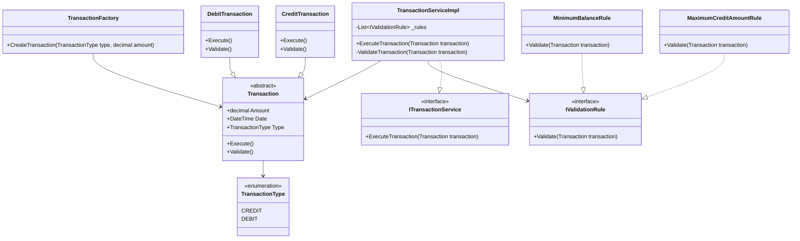

# Système de Gestion des Transactions

## Description
Application console de gestion des transactions financières développée en .NET. Cette version permet aux utilisateurs de réaliser des opérations de crédit et de débit via une interface en ligne de commande.

## Diagramme de Classes du Core



## Flux de l'Application Console


## Installation

1. Prérequis :
   - .NET 8.0 ou supérieur
   - Visual Studio 2022 ou VS Code  

2. Clonez le dépôt :
```bash
git clone https://github.com/mdbouz89/TransactionManagement
```

3. Accédez au dossier du projet console :
```bash
cd TransactionManagement.Console
```

4. Restaurez les dépendances :
```bash
dotnet restore
```

5. Compilez le projet :
```bash
dotnet build
```

## Utilisation

1. Lancez l'application :
```bash
dotnet run
```

2. Menu Principal :
   - Choisissez le type de transaction (CREDIT/DEBIT)
   - Entrez le montant de la transaction
   - Suivez les instructions à l'écran

3. Règles de Validation :
   - Montant maximum pour les crédits : 10000
   - Solde minimum après débit : -5000
   - Montant minimum : 0.01

## Tests

Pour exécuter les tests :
```bash
cd TransactionManagement.Tests
dotnet test
```

## Fonctionnalités

- Création de transactions de crédit et débit
- Validation des transactions selon des règles métier
- Interface utilisateur en ligne de commande intuitive
- Gestion des erreurs et affichage des messages appropriés
- Historique des transactions effectuées